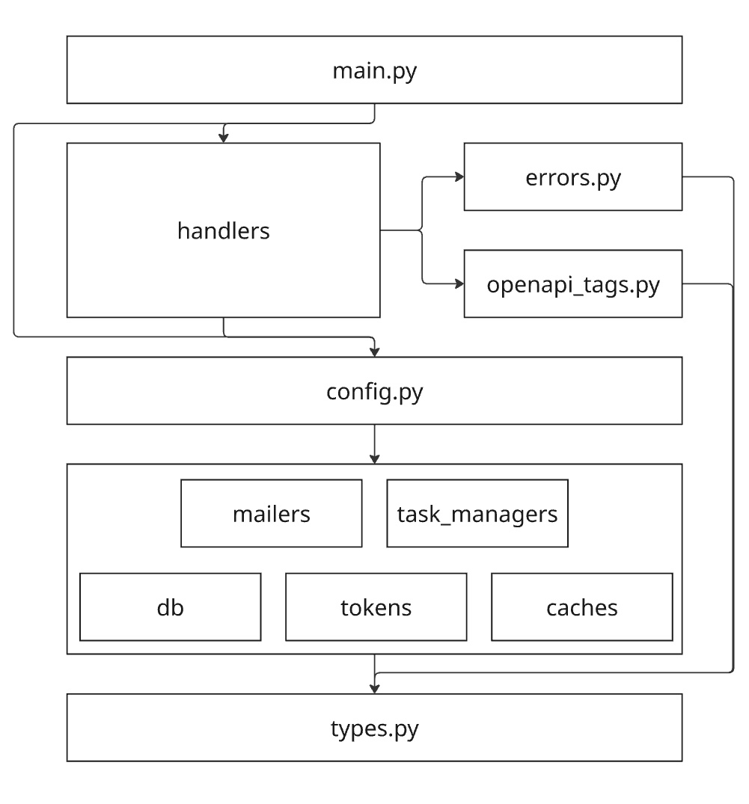

# LootX

A REST API backend built with **Litestar**, serving loot queue management for World of Warcraft.

# Running the Application

To start the application:
```bash
uvicorn app.main:app
```

# OpenAPI Documentation

OpenAPI schema is available at:
```
/schema
```

## Architecture



- `main.py` initializes all dependencies and starts the Litestar application.
- `handlers/` contains all route handlers.
- `errors.py` defines all HTTP exceptions.
- `openapi_tags.py` stores tags for OpenAPI documentation.

- `config.py` holds global settings and collects all modules and their configurations (actual initialization happens in `main.py`).

- `mailers.py`, `task_managers.py`, `db.py`, `tokens.py`, and `caches.py` are modular components.

- `types.py` defines shared types used throughout the application.

The project follows a **modular architecture based on Dependency Injection**: any module (cache, database, mailer, task manager, token) can be replaced as long as it implements the correct interface.

## Testing

To run tests:
```bash
pytest
```

### Docker Launch

To run a development version inside Docker:
```bash
docker-compose up --build -d
```
